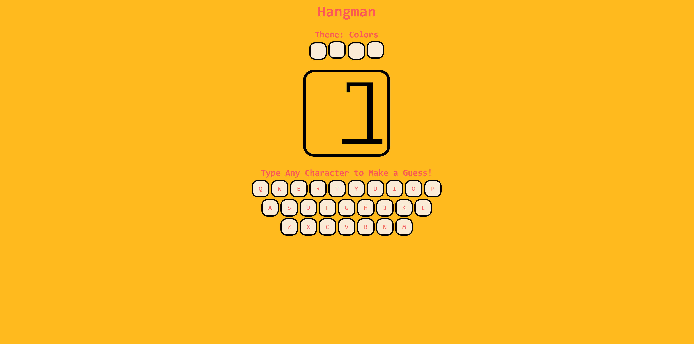
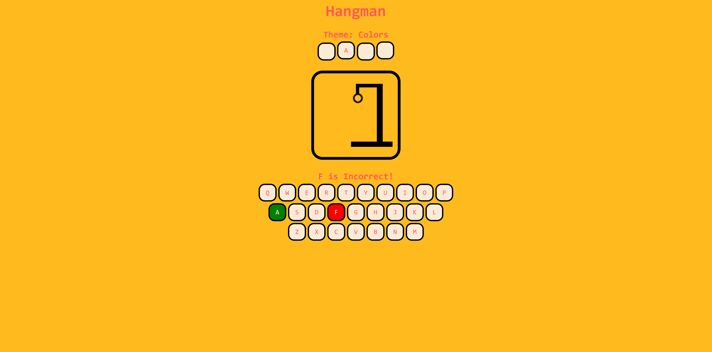
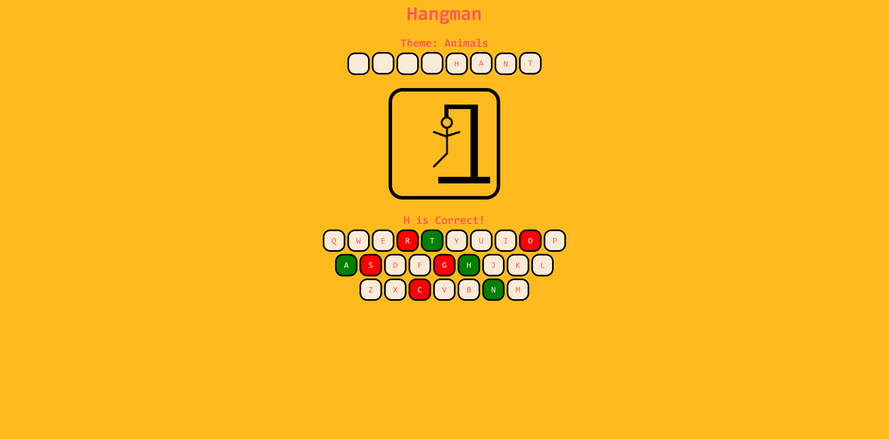
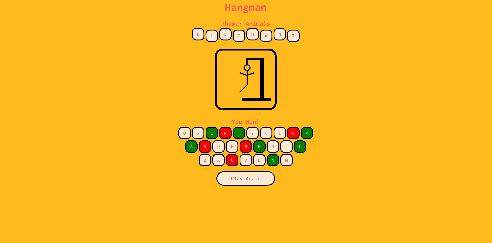
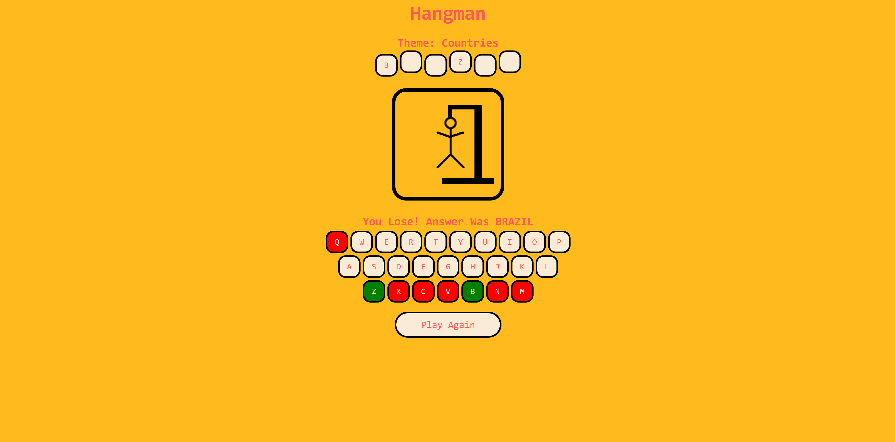

# Hangman  
A simple Hangman game built with HTML, CSS, and vanilla JavaScript.

## Technologies  
- HTML5  
- CSS3  
- JavaScript (ES6)

## Features  
- Classic Hangman gameplay  
- Random word selection from different themes
- Clean, unique UI with an on screen keyboard, animations and visual feedback

## Project Motivation  
This project was a chance to revisit front‑end and javascript fundamentals and build a small, complete game without frameworks. It helped reinforce DOM manipulation, event handling, and state management while keeping the experience polished and user‑friendly.

## Things I Learned / Practiced  
- Managing game state with plain JavaScript  
- Handling keyboard input and updating the UI  
- Structuring small front‑end projects cleanly  
- Designing simple, readable CSS for interactive elements

## Possible Improvements  
- Adding difficulty modes with different words or number of guesses
- While the game is responsive and will resize for mobile screens, a mobile designed UI could enhance it.
- Moving the word list into an external .txt, .json, or API source to make the game more scalable and easier to update.

## Installation  
1. Clone the repository  
2. Open `index.html` in your browser  
3. Start playing!

## Screenshots  
A quick look at the interface and gameplay:

